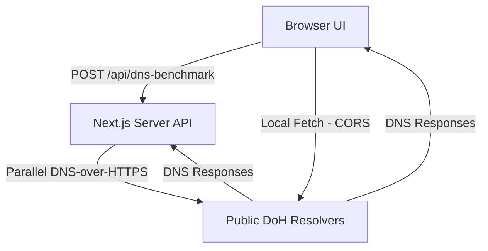

# ⚡ DNS Speed Test & DNS Server Comparison

A beautiful, high-performance, and feature-rich DNS speed test utility built with Next.js (App Router), Tailwind CSS v4, and Shadcn UI. It benchmarks public DNS-over-HTTPS (DoH) providers in real time and helps you configure the fastest, most reliable DNS settings for your device or router.

---

## ✨ Features

- **🚀 Live DNS Benchmarking**: Runs real DNS lookups against multiple popular public DNS providers simultaneously.
- **📊 Interactive Latency Charts**: Beautiful SVG comparison charts dynamically visualizing DNS latency and performance.
- **🛠️ Custom DNS Resolvers**: Add your own custom DNS-over-HTTPS (DoH) endpoints (e.g. self-hosted Pi-hole, AdGuard Home, or custom NextDNS profiles) to benchmark them against public defaults.
- **🌐 Dual Test Modes**: Toggle between:
  - **Server Mode**: Benchmarks from the hosting server (stable, fast network).
  - **Browser Mode**: Benchmarks directly from your client browser to measure true local ISP-to-DNS latency.
- **🔗 Shareable Reports**: Instantly serialize and share your benchmark results with a base64-encoded URL state without needing a database.
- **🌓 Theme Switching**: Seamless dark and light modes matching your system preferences.
- **📋 Copyable Configuration**: Easily copy recommended primary and secondary IPv4 addresses to configure your system.

---

## 🏗️ Architecture



The application uses standard DNS-over-HTTPS wire format query payloads transmitted via GET requests with standard `application/dns-message` headers to get precise responses and avoid server cache hits.

---

## 🛠️ Local Development Setup

To set up DNS Speed Test on your local machine:

1. **Clone the repo**:
   ```bash
   git clone https://github.com/your-username/dns-test.git
   cd dns-test
   ```

2. **Install dependencies**:
   ```bash
   npm install
   ```

3. **Run the dev server**:
   ```bash
   npm run dev
   ```

4. Open [http://localhost:3000](http://localhost:3000) in your browser.

---

## 🧼 Code Quality Checks

Before contributing, verify your changes by running:
```bash
# Code style and checks
npm run lint

# TypeScript compilation check
npx tsc --noEmit

# Production build check
npm run build
```

---

## 📄 License

This project is licensed under the MIT License. See [LICENSE](LICENSE) for details.
